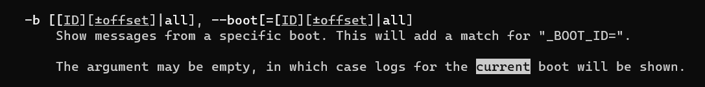

# Exam_2420

# Author 
Dennis Phan  

## Answers

### Part 1 

Run the commands below to check for update and upgrade your software on Ubuntu OS

```
sudo apt update  
sudp apt upgrade 
```

### Part 2

Use 'vim <filename>
Use 'x' to delete single characters  
Use 'r' to replace single characters  
Use ':%s/before/after/g' where before is 'eco' and after is 'echo'   
  
  
    
  
  
### Part 3

   

   

  

  

  
  
  
  
Final command  

  
  

### Part 4  
  
This is in /opt/
  
Create /opt/ in home directory with mkdir /opt
  
```
#!/bin/bash

user=$(whoami)

echo 'Regular users on the system are:'
grep -rE '[1][0-9]{3}' "/etc/passwd"

echo 'Users currently logged in are:'
echo ${user} > /etc/motd
``` 
  
### Part 5  
  
  This is in /etc/systemd/system  
  
  The file name is find_user.service    
  ```
[Unit]
Description=run find_users to write to /etc/motd

[Service]
Type=simple
ExecStart=/opt/find_users
Restart=on-failure

[Install]
WantedBy=multi-user.target
```

  
  
### Part 6
  
  This is in /etc/systemd/system  
  
  The file name is find_user.timer  
  
  ```
[Unit]
Description=starts 1 min from boot for find_user.service

[Timer]
OnBootSec=1min
OnUnitActiveSec=24h
Unit=find_user.service

[Install]
WantedBy=timers.target
```

  
  

  
 
  
 
